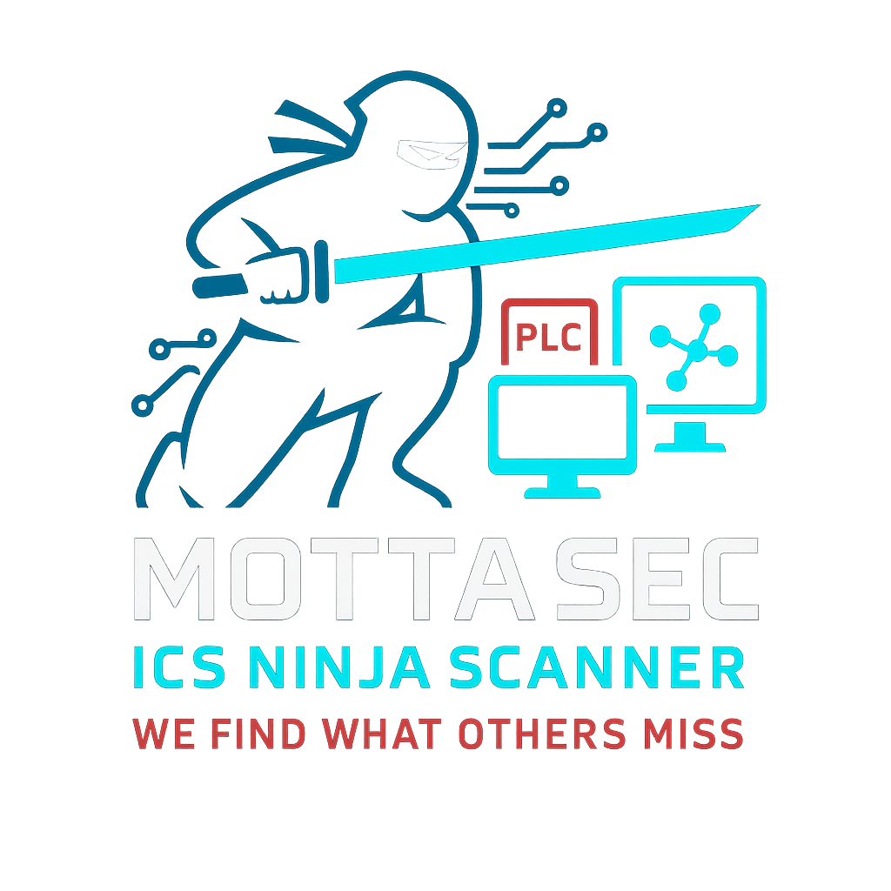

# MottaSec ICS Ninja Scanner

<p align="center">

</p>

A multi-protocol Industrial Control System (ICS) security scanner that detects misconfigurations, weak implementations, and security flaws in industrial control systems. Created by the MottaSec Ghost Team - the unseen guardians of industrial systems.

> "We find what others miss" - MottaSec Ghost Team

## 🚀 Features

- **Multi-protocol support**: Modbus, DNP3, BACnet, Siemens S7, EtherNet/IP, OPC-UA, Profinet, IEC 104, SNMP, MQTT, and more
- **Adjustable scanning intensity**: 
  - 🟢 **Low**: Passive scan (device discovery, version detection)
  - 🟡 **Medium**: Query system state (read registers, security settings)
  - 🔴 **High**: Simulated attack vectors (unauthenticated control attempts, write tests)
- **Customizable target selection**: Single IP, IP range, or subnet
- **Comprehensive reporting**: Multiple output formats (TXT, JSON, CSV)
- **Safe-by-default**: No destructive actions unless explicitly enabled
- **Modular architecture**: Easily extensible with new protocol scanners

## 🛠️ Installation

```bash
# Clone the repository
git clone https://github.com/mottasec/ics-ninja-scanner.git
cd ics-ninja-scanner

# Create a virtual environment (recommended)
python -m venv venv
source venv/bin/activate  # On Windows: venv\Scripts\activate

# Install dependencies
pip install -r requirements.txt

# Install as a package (optional)
pip install -e .
```

## 🔍 Usage

```bash
# Basic usage
python ics_scanner.py scan --target 192.168.1.100 --protocols modbus,snmp --intensity low

# Scan an entire subnet with medium intensity
python ics_scanner.py scan --target 192.168.1.0/24 --protocols all --intensity medium

# Generate a comprehensive report
python ics_scanner.py scan --target 192.168.1.0/24 --protocols all --intensity high --output-format json,csv --output-file scan_results

# Enable debug logging
python ics_scanner.py scan --target 192.168.1.100 --protocols all --intensity low --debug
```

### Command Line Options

```
Usage: ics_scanner.py [OPTIONS] COMMAND [ARGS]...

Options:
  --help  Show this message and exit.

Commands:
  scan     Run a security scan against ICS targets
  list     List available protocols and scan options
  version  Show the version of the tool
```

#### Scan Command Options

```
Usage: ics_scanner.py scan [OPTIONS]

  Run a security scan against ICS targets

Options:
  --target TEXT              Target IP, IP range, or subnet  [required]
  --protocols TEXT           Comma-separated list of protocols or 'all'  [required]
  --intensity [low|medium|high]
                             Scan intensity level  [default: low]
  --output-format [txt|json|csv|all]
                             Output format  [default: txt]
  --output-file TEXT         Output file name (without extension)
  --port-range TEXT          Custom port range to scan (default: protocol standard ports)
  --timeout INTEGER          Connection timeout in seconds  [default: 5]
  --threads INTEGER          Number of threads for parallel scanning  [default: 10]
  --no-verify                Disable SSL/TLS verification for protocols that support it
  --debug                    Enable debug logging
  --help                     Show this message and exit.
```

## 🔒 Supported Protocols and Security Checks

| Protocol | Description | Key Security Checks |
|----------|-------------|---------------------|
| **Modbus** | Industrial automation protocol | Device detection, unauthenticated access, register read/write tests |
| **DNP3** | SCADA protocol | Outstation enumeration, encryption checks, unsecured function calls |
| **BACnet** | Building automation | Device scanning, authentication checks, property access testing |
| **Siemens S7** | PLC communication | PLC discovery, credential checks, remote access security |
| **EtherNet/IP** | Industrial automation | ControlLogix detection, CIP service enumeration, access control |
| **OPC-UA** | Industrial data exchange | Server enumeration, authentication and encryption validation |
| **Profinet** | Factory automation | Device discovery, authentication checks, configuration tests |
| **IEC 104** | Power grid protocol | Device scanning, encryption verification, authentication testing |
| **SNMP** | Network management | Community string checks, information disclosure, version detection |
| **MQTT** | IoT messaging | Broker detection, authentication checks, topic access control |

## 🛡️ Safety Notes

This tool is designed for security assessment by authorized personnel. Always:

1. 🔐 Get proper authorization before scanning any ICS environment
2. 🚦 Start with low-intensity scans in production environments
3. ⏰ Schedule scans during maintenance windows for high-intensity tests
4. 👀 Monitor systems during scanning for any adverse effects

## 🧪 Testing

We've developed a comprehensive test suite to ensure the reliability and correctness of the ICS Ninja Scanner. Our tests cover all critical components and functionality.

### Test Coverage

| Category | Tests | Description |
|----------|-------|-------------|
| **Core Scanner** | 8 tests | Tests for the main scanner CLI interface, protocol validation, and command execution |
| **Base Scanner** | 3 tests | Tests for the abstract base scanner class functionality |
| **Protocol Scanners** | 30+ tests | Tests for individual protocol scanners (Modbus, SNMP, MQTT, etc.) |
| **Utilities** | 4+ tests | Tests for network utilities, reporting functions, and configuration management |

### Key Test Cases

1. **Protocol Validation**
   - Validate single protocol selection
   - Validate multiple protocol selection
   - Validate 'all' protocols option
   - Reject invalid protocols
   - Reject mixed valid/invalid protocols

2. **Scanner Functionality**
   - Test scanner initialization with different parameters
   - Verify scanner behavior when target is unavailable
   - Validate issue reporting format
   - Test different intensity levels

3. **MQTT Scanner Tests**
   - Test MQTT broker detection
   - Verify anonymous access detection
   - Test unencrypted traffic detection
   - Validate topic access control checks

4. **SNMP Scanner Tests**
   - Test SNMP device detection
   - Verify community string testing
   - Validate version detection
   - Test write access verification

### Running Tests

```bash
# Run all tests with detailed output
python test/run_tests.py

# Run specific test file
python -m unittest test/test_ics_scanner.py

# Run specific test case
python -m unittest test.scanners.test_mqtt_scanner.TestMQTTScanner.test_scan_with_mqtt_available
```

Our test suite uses Python's built-in unittest framework with mocking to simulate network interactions, ensuring tests can run without actual ICS devices.

## 🌟 Why MottaSec ICS Ninja Scanner?

At MottaSec, we approach industrial security differently. Our team of security ninjas, ghosts, foxes, and jedis work tirelessly to protect critical infrastructure from cyber threats. We created this tool for our internal use, but decided to share it with the community to improve ICS security worldwide.

The ICS Ninja Scanner was developed by our Ghost Team - the unseen guardians of industrial systems who specialize in finding vulnerabilities that others miss. With decades of combined experience in ICS security, our team has seen it all - from ancient PLCs running critical infrastructure to modern IoT-enabled smart factories.

## 📞 Contact

If you have questions, suggestions, or need professional ICS security services, contact us at:

- Email: ghost@mottasec.com
- Website: [https://www.mottasec.com](https://www.mottasec.com)

## 📄 License

This project is licensed under the MottaSec Community License - see the [LICENSE](LICENSE) file for details.

---

Made with ❤️ by the MottaSec Ghost Team 